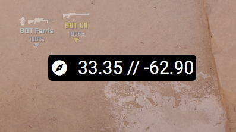

## Purpose
Create a small widget that displays your view angles, similar to how the now restricted command `cl_showpos` used to function. No memory access.

## Setup
1. Place `-condebug` in your CS2 launch options
2. Run `cl_track_render_eye_angles 1` in-game
3. Once the script is running, visit `http://localhost:8080/` in your steam browser, and pin the window

## Planned
- Retrieve world coordinates (This can be done by screencapping the in-game radar position, reorienting it with our view angles, and locating it on the map overview)
- Indicator for when a preset utility is correctly lined up